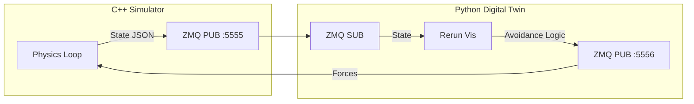

# Nano-Streamer: C++17 & Python Digital Twin Drone Simulator

Experimental High-Performance Digital Twin framework demonstrating **Hybrid Engineering**: Heavy physics in **C++17** and Agile visualization/control in **Python**.


## 🎥 Demo

*Real-time Rerun visualization of the C++ physics engine avoiding obstacles.*

## 🚀 Overview

This project simulates a quadcopter drone in a physics environment entirely in **C++17** for performance, while Offloading the "Intelligence" and "Visualization" to **Python** via **ZeroMQ**.

It demonstrates:
- **Systems Programming**: Low-latency IPC design using ZeroMQ.
- **Physics Engine**: Custom particle physics and Raycasted Lidar sensor implementation in C++.
- **MLOps/Viz**: Real-time visualization using **Rerun SDK**.

## 🏗 Architecture

The system is decoupled into two independent processes:

1.  **The Host (C++17)**: 
    - Runs the physics loop at 60Hz+.
    - Handles Collision Detection & Lidar Raycasting.
    - Publishes State (Position, Velocity, Sensor Data) via ZMQ PUB.
    - Listens for Control Forces (Thrust + Vector) via ZMQ SUB.

2.  **The Brain (Python)**:
    - Subscribes to the Host's state.
    - Visualizes the world using **Rerun**.
    - Executes High-level logic (e.g., Obstacle Avoidance, Path Planning).
    - Publishes Control Commands back to the Host.



## 🛠 Prerequisites

- **C++ Compiler**: C++17 compliant (Clang/GCC/MSVC)
- **CMake**: 3.14+
- **Python**: 3.8+

## 📦 Installation & Run

### 1. Build C++ Core
```bash
mkdir build && cd build
cmake ..
make
```

### 2. Install Python Dependencies
```bash
pip install -r python/requirements.txt
```

### 3. Run Simulation
Open two terminal tabs:

**Tab 1: Start Physics Engine**
```bash
./build/drone_sim
```

**Tab 2: Start Digital Twin**
```bash
python3 python/scripts/vis_twin.py
```

## 🎮 Controls (Manual Mode)

Focus on the terminal window running `vis_twin.py` to control the drone.

- **`M`**: Toggle Auto / Manual Mode
- **`W` / `S`**: Move Forward / Backward
- **`A` / `D`**: Move Left / Right
- **`Space`**: Thrust Up (Lift)
- **`Shift`+`Z`** (or just gravity): Drop

## 🧠 Customizing the "Brain"
You can modify the autonomous logic in `python/scripts/vis_twin.py`.
The simulator accepts force vectors:
```json
{
    "fx": 0.0,
    "fy": 10.0,
    "fz": 5.0
}
```
Try implementing your own PID controller or Reinforcement Learning agent!

## 📝 License
MIT License
